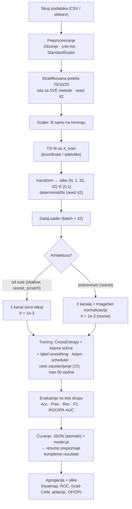

# Seminar 2 — Nacrt seminarskog rada

> **Status nacrta: 3. septembar 2026.** Rad se piše paralelno sa finalnom serijom
> eksperimenata (Google Colab). Svi brojčani rezultati su **TBD (da se popune)**
> i eksplicitno su označeni. Tehničke činjenice u tekstu (postupci, hiperparametri,
> arhitekture, konfiguracije) odgovaraju finalnom kodu i **ne menjati bez provere**
> sa `Plan/paper-statement-guide.md` (delovi PART 1–13) — tamo je zabeležen razlog
> za svaku konfiguracionu odluku. Jezik i stil prate prethodni seminarski rad iz
> Mašinskog učenja („Mašinsko učenje u IDS“): gusta formalna proza, numerisane
> formule, slike/tabele/listinzi sa oznakama, reference u IEEE stilu [n].
>
> Poglavlje **5. Implementacija** sadrži isečke iz koda (listingi 5.1–5.11) sa
> objašnjenjima *zašto* je svaki pristup izabran. Listingi su skraćeni izvodi,
> ali **svaka prikazana linija odgovara liniji u repozitorijumu** (provereno
> 2026-09-03); elidirani delovi označeni su redom „…“, a izvor svakog listinga
> naveden je u caption-u (npr. 5.6: `run_all.py` i `src/train.py`).

---

## Naslovna strana (šablon)

- **Univerzitet u Novom Sadu, Prirodno-matematički fakultet**
- Departman za matematiku i informatiku
- **Seminar II (ID212)** — tema: *Konverzija tabelarnih podataka u slike i
  klasifikacija konvolucionim neuronskim mrežama*
- Student: Luka Momčilović 39d/25
- Komisija: prof. dr Miloš Radovanović, prof. dr Zoran Racković

---

# 1. Uvod

U velikom broju praktičnih domena podaci su organizovani **tabelarno** — svaki
primer opisan je vektorom atributa fiksne dužine, pri čemu atributi nemaju
unutrašnju prostornu strukturu. Klasični algoritmi mašinskog učenja (stabla
odlučivanja, ansambli, linearni modeli) prirodno su prilagođeni ovakvom zapisu,
dok konvolucione neuronske mreže (CNN), koje dominiraju obradom slika, zahtevaju
ulaz u obliku dvodimenzionalnog rastera. Poslednjih godina pojavio se zaseban
pravac istraživanja koji tabelarne vektore **preslikava u slike**, a zatim
klasifikaciju prepušta konvolucionim mrežama. Ideja vodilja je da se korelacije
između atributa mogu prostorno „spakovati“ tako da konvolucioni operatori, koji
su inherentno lokalni, uče interakcije između atributa bez eksplicitnog
ručnog konstruisanja karakteristika [1], [2], [3].

Motivacija za ovakav pristup nije trivijalna: preslikavanje u sliku je
**gubitna transformacija** — konačan broj atributa mora se rasporediti po
diskretnoj mreži piksela, pri čemu raspored direktno određuje šta konvoluciona
jezgra „vide“. Naivno rešenje (redom pakovati atribute u mrežu) ne koristi
informaciju o povezanosti atributa, dok naprednije metode pokušavaju da u prostor
slike prenesu **statističku strukturu podataka**: slični (korelisani) atributi
završavaju na susednim pozicijama, a različiti na udaljenim. U radu se upoređuje
četiri reprezentativna postupka ove vrste — naivno pakovanje, projekcione
metode (DeepInsight, TINTO) i permutaciona metoda zasnovana na rangovima
rastojanja (IGTD) — na tri heterogena skupa podataka i sa **tri
konvolucione arhitekture različitog kapaciteta**, uključujući modele sa
transfer učenjem (pretrenirani ResNet-18). Tokom validacije protokola
testiran je i pretrenirani ViT-Base/16, ali on nije deo glavne serije
eksperimenata iz računskih razloga (zahteva GPU vreme; §3.3, §4.4, §7).

Cilj rada je da se odgovori na sledeća istraživačka pitanja:

1. Da li izbor prostornog rasporeda atributa utiče na performanse CNN-a i koliko?
2. Da li transfer učenje sa slika prirodnog domena (ImageNet) pomaže ili odmаže
   na sintetičkim slikama tabelarnog porekla?
3. Kako se rezultati CNN + T2I odnose na klasične metode mašinskog učenja
   (Random Forest, XGBoost, MLP) na istim podacima?
4. Koji faktori — gustina slike, preklapanje atributa, kapacitet mreže, stopa
   učenja — objašnjavaju razlike u performansama?

Rad je organizovan na sledeći način. U **odeljku 2** dat je pregled stanja u
oblasti konverzije tabelarnih podataka u slike. **Odeljak 3** uvodi teorijske
osnove: postupke preslikavanja, konvolucione arhitekture i metrike. **Odeljak 4**
opisuje eksperimentalnu postavku: skupove podataka, protokol treninga i
hiperparametre. **Odeljak 5** daje pregled implementacije — organizaciju koda,
ključne isečke sa obrazloženjima i dijagram toka podataka. **Odeljak 6**
prikazuje rezultate, a **odeljak 7** ih diskutuje. **Odeljak 8** sadrži
zaključak, a **odeljak 9** reference i priloge.

---

# 2. Pregled stanja

## 2.1 Konverzija tabelarnih podataka u slike kao istraživački pravac

Ideja da se tabelarni podaci konvertuju u slike nije nova — prvi sistematski
predlog u savremenoj formi dali su Sharma i saradnici u okviru metode
**DeepInsight** [1], gde se atributi projicuju u 2D ravan (t-SNE ili PCA),
a zatim mapiraju na pozicije piksela. Ubrzo zatim, Zhu i saradnici su u metodi
**IGTD** [2] predložili drugačiji princip: umesto projekcije, raspored atributa
se bira tako da se **rangovi rastojanja** između atributa što vernije poklope sa
rangovima rastojanja između pozicija u mreži piksela. Objavljen je i veći broj
varijanti i hibrida: **REFINED** (kombinacija karata udaljenosti i vizuelnog
sličnosti), **TINTO** [3], koji uvodi umekšavanje (blur) oko pozicija atributa
kako bi se stvorili kontinualni gradijenti pogodni za konvolucije, zatim
**S-IGTD** sa nadgledanom topologijom (rastojanja između atributa zasnovana na
klasnim sredinama) [4] i druge. Pojedini radovi eksperimentišu i sa alokacijom
različitog broja piksela po atributu srazmerno njihovoj informativnosti [5].

## 2.2 Empirijska evidencija i obim

Nedavna velika studija [6] (9 metoda, 24 skupa podataka) pokazuje da T2I pristupi
mogu da pariraju, a u pojedinim slučajevima i nadmaše klasične ansamble
(npr. Table2Image ostvaruje 0,879 naspram 0,868 tačnosti XGBoost-a), ali da
rezultati jako zavise od izbora metode i skupa. Sistematski pregledi literature
[S-LR materijali — SLR folder] ukazuju na nekoliko otvorenih pitanja: (i) fer
poređenje sa podešenim klasičnim modelima, (ii) uticaj gustine slike (udeo
nenultih piksela) na naučenost konvolucija, (iii) ponašanje pretreniranih mreža
na sintetičkim slikama koje se strukturno razlikuju od prirodnih, i (iv)
odsustvo standardizovanih dijagnostičkih mera kvaliteta preslikavanja (npr.
mera preklapanja atributa na istom pikselu).

## 2.3 Pozicija ovog rada

U odnosu na navedene studije, ovaj rad je užeg obima ali sistematičan: **isti
protokol** (iste podele podataka, isti hiperparametri, isti način evaluacije)
primenjen je na sve kombinacije postupaka i arhitektura, uz eksplicitne
kontrolne eksperimente (ablacije) kojima se proverava da li prostorna struktura
uopšte doprinosi rezultatu. Dodatno, rad transparentno beleži i dijagnostikuje
poznate zamke protokola — jednokratnu podelu skupa, nepodešene baselajne,
različite opsege vrednosti piksela između metoda i izbor stope učenja za
pretrenirane modele — što u literaturi često ostaje nedokumentovano.

---

# 3. Teorijske osnove

## 3.1 Tabelarni podaci i izazovi konverzije

Neka je $X \in \mathbb{R}^{N \times d}$ matrica podataka sa $N$ primera i
$d$ atributa, a $y$ vektor ciljnih klasa. Tabelarni zapis karakterišu:

- **odsustvo prostorne strukture** — redosled atributa je (uglavnom) proizvoljan;
- **mešoviti tipovi** — numerički i kategorički atributi (kategorički se najčešće
  kodiraju one-hot tehnikom, čime raste dimenzionalnost);
- **različite skale** — atributi se standardizuju (StandardScaler) na trening
  skupu, da transformacija ne zavisi od test podataka (sprečavanje curenja
  informacija);
- **klasni disbalans** — neravnomerna zastupljenost klasa zahteva poseban tretman
  u funkciji gubitka i izbor metrike.

Konverzija u sliku $I \in [0,1]^{h \times w}$ svodi se na dve odluke:
**(a)** gde u mreži piksela smestiti svaki atribut (mapiranje koordinata) i
**(b)** kako vrednost atributa preneti u intenzitet piksela. Prva odluka je
presudna i čini suštinsku razliku između metoda.

## 3.2 Postupci preslikavanja

### 3.2.1 Naivno mapiranje (osnovna linija)

Najjednostavniji postupak: vektor atributa se dopuni nulama do najbližeg
kvadrata $g = \lceil \sqrt{d} \rceil$ i preoblikuje u matricu $g \times g$,
redom (row-major). Ako je $g \neq h$ (ciljna veličina slike), matrica se
bikubičnom interpolacijom skalira na $h \times w$. Intenziteti se normalizuju
min-max skaliranjem na opseg $[0,1]$, pri čemu se minimum i maksimum računaju
**isključivo na trening skupu** (u ranijoj verziji koda normalizacija po
podskupu izazivala je različite opsege za trening/validaciju/test — curenje
informacija; ispravljeno čuvanjem statistika u fazi `fit`, listing 5.3).

Prednosti: jednostavnost i determinizam. Mane: raspored prati ulazni redosled
atributa i ne vodi računa o njihovoj povezanosti; visoko korelisani atributi
mogu završiti na suprotnim krajevima slike, a dopunjena zona čini traku skoro
nultih vrednosti.

### 3.2.2 DeepInsight

DeepInsight [1] preslikava atribute u ravan primenom algoritma smanjenja
dimenzionalnosti nad **atributima kao tačkama**: atribute (kolone) tretiramo
kao tačke u prostoru uzoraka, pa se na transponovanu matricu primenjuje PCA
(glavne komponente, u TINTOlib implementaciji korišćenoj u ovom radu) i dobijaju
dvodimenzione koordinate $p_i \in \mathbb{R}^2$. Kako su podaci pre toga
standardizovani po atributima, geometrija koordinata odražava (korelacionu)
strukturu linearnih veza među atributima, pa korelisani atributi završavaju
blizu jedan drugog. Koordinate se zatim skaliraju u opseg mreže piksela, a
svaki atribut dobija svoj piksel. Kako više atributa može da padne u istu ćeliju,
definiše se tzv. matrica gustine karakteristika (Feature Density Matrix — FDM);
pikseli sa više atributa čuvaju **srednju** vrednost (grupa „avg”), što je
gubitna kompresija. Zato se uvode dijagnostičke mere:

- $OF$ (Overlapped Features) — procenat atributa koji dele piksel sa nekim
  drugim atributom;
- $OP$ (Overlapped Pixels) — procenat aktivnih piksela sa više od jednog
  atributa.

### 3.2.3 IGTD

IGTD [2] ne koristi projekciju. Neka su $D_F$ i $D_P$ matrice rastojanja:
$D_F(i,j)$ — rastojanje između atributa $i$ i $j$ (Pearson-ova korelacija
pretvorena u rastojanje, u ovom radu $1 - \rho$, kako je implementirano u
TINTOlib-u), a $D_P(i,j)$ — Euklidovo
rastojanje između pozicija u mreži piksela. Za obe matrice računaju se matrice
**rangova** $R_F$ i $R_P$ (svako rastojanje dobija svoj rang među svim parovima).
Cilj je pronaći permutaciju atributa po pozicijama koja minimizuje Frobenijusovu
normu razlike rangova:

$$
\min_{\pi} \; \lVert R_F - R_P^{(\pi)} \rVert_F,
$$

što se rešava iterativnom zamenom (swap) pozicija dok se greška smanjuje
(maksimalno `max_step` iteracija, provera na svakih `val_step`). IGTD je po
konstrukciji **bez kolizija** ($OF = OP = 0$), a izlaz je gusti raster
vrednosti $[0, 255]$ koji se deli sa 255 radi uporedivosti sa ostalim metodama.

### 3.2.4 TINTO

TINTO [3] kombinuje projekcioni princip DeepInsight-a sa **umekšavanjem**:
nakon pozicioniranja atributa, svaka vrednost se „razmazuje“ na okolne piksele
Gausovim jezgrom (parametri: pojačanje amplifikacije $\approx \pi$, rastojanje
$2$, koraci $4$, broj ponavljanja $4$; sve vrednosti su podrazumevane
vrednosti TINTOlib biblioteke). Time nastaju kontinualni gradijenti koje
konvoluciona jezgra $3\times3$ mogu da „uhvate“ i na uređenoj prostornoj skali.
TINTO je jedina od korišćenih metoda koja **ne garantuje** opseg $[0,1]$ nakon
umekšavanja (vrhovi se kompresuju; izmereno je do ~0,30 na skupu Breast Cancer),
pa se njegov izlaz normalizuje statistikama prvog (trening) transforma — detalj
koji je presudan za ispravan rad pretreniranih mreža (videti 3.4 i 5.6).

### 3.2.5 S-IGTD (koncept; nije deo finalnog poređenja)

S-IGTD [4] modifikuje IGTD tako što se rastojanja atributa računaju iz
**klasnih sredina**: za atribut $j$, vektor $\mu_j = (\bar{x}_j^{(1)}, \dots,
\bar{x}_j^{(C)})$ srednjih vrednosti po klasama, pa $D_B(i,j) = 1 - |\mathrm{corr}
(\mu_i, \mu_j)|$. Time se diskriminativni atributi grupišu lokalno. Tokom
implementacije za ovaj rad utvrđeno je da ugradjena verzija (preko TINTOlib-a)
nije zaista koristila nadgledana rastojanja u optimizaciji rasporeda — njene
slike bile su identične IGTD slikama (provera: nula razlika u koordinatama i
pikselima). Umesto prikazivanja duplikata, **S-IGTD je izostavljena iz finalnog
poređenja**, a u ovom radu se pominje samo kao srodan pristup iz literature.

### 3.2.6 Dijagnostika kvaliteta preslikavanja

Pored $OF/OP$, prati se i **gustina slike** — udeo piksela sa vrednošću iznad
praga $0{,}01$ — jer konvolucije na gotovo praznoj slici uče dominantno
konstantan pozadinski signal. Gustina se meri po metodi i skupu (slika
`t2i_density_comparison.png`).

## 3.3 Konvolucione neuronske mreže

Konvolucioni sloj računa, za izlazni kanal $k$ i poziciju $(i,j)$,

$$
z_{i,j}^{(k)} = b_k + \sum_{c=1}^{C_{in}} \sum_{u=0}^{K-1}\sum_{v=0}^{K-1}
w_{k,c,u,v}\, x_{i+u,\,j+v}^{(c)},
$$

nakon čega sledi aktivacija $\mathrm{ReLU}(z) = \max(0, z)$, normalizacija po
minibatču (BatchNorm) i redukcija rezolucije (max pooling). Slojevi uče lokalne
obrasce; dublji slojevi kombinuju obrase u apstraktnije karakteristike.
Kapacitet i induktivna pristrasnost (lokalnost, translaciona invarijantnost)
čine CNN prirodnim kandidatom za obradu „sintetičkih slika“ T2I postupaka.

**ShallowCNN** — mreža iz ovog rada (~620K parametara): tri konvoluciona bloka
(32, 64, 128 kanala, jezgro $3\times3$, BatchNorm, ReLU, max pooling),
adaptivno prosečno grupisanje na $4\times4$ i klasifikator sa dva skrivena sloja
(256, Dropout 0,3). Odsustvo pretreniranosti i male dubine čine je „poštenom“
osnovom: ako napredni T2I raspored pomaže na ovoj mreži, efekat se ne može
pripisati kapacitetu ili transfer učenju.

**ResNet-18** — rezidualna arhitektura sa blokovima oblika
$y = \mathcal{F}(x, W) + x$, ~11M parametara. U radu se koristi u dve varijante:
pretrenirana na ImageNet-u (`pretrained=True`, ulaz 3 kanala sa ImageNet
normalizacijom) i od nule (`pretrained=False`, ulaz 1 kanal — siva slika).
Ova dva režima razdvajaju efekat **kapaciteta** od efekta **pretreniranosti**.

**ViT-Base/16** — Vision Transformer, ~86M parametara, patch veličine 16.
Slika $32\times32$ se bilinearnom interpolacijom skalira na $224\times224$
(196 tokena), svaki token je linearna projekcija $16\times16$ bloka uvećana
pozicionim enkodingom, a jezgro mreže je višeglavi self-attention:

$$
\mathrm{Attention}(Q,K,V) = \mathrm{softmax}\!\left(\frac{QK^{\mathsf{T}}}{\sqrt{d_k}}\right) V .
$$

> **Napomena o obuhvatu studije (2026-09-03):** pretrenirani ViT-Base/16
> korišćen je tokom validacije protokola (otkrio je zavisnost od stope
> učenja opisanu u §3.4), ali nije deo glavne serije eksperimenata:
> fino podešavanje zahteva GPU vreme (~15 s po epohi na GPU naspram
> ~830 s na CPU), a rezultati sa GPU okruženja su izgubljeni.
> Rezultatske tabele u §6 pokrivaju tri arhitekture; ViT se u matricu
> vraća komandom `--archs shallow,resnet,resnet_scratch,vit`.

## 3.4 Transfer learning i protokol treninga

Pretrenirane mreže (ResNet-18 i ViT na ImageNet-u) očekuju ulaz normalizovan
ImageNet statistikama (srednja vrednost $[0.485, 0.456, 0.406]$, standardno
odstupanje $[0.229, 0.224, 0.225]$). Siva slika se ponavljanjem kanala prevodi u
RGB pre normalizacije; prvi konvolucioni sloj zadržava originalne trokanalne
težine (ovo je bila kritična ispravka tokom razvoja — bez normalizacije
pretrenirani modeli su kolabirali na predviđanje jedne klase; listing 5.6).

Funkcija gubitka je unakrsna entropija sa:
- **klasnim težinama** (inverzna učestanost klasa, sklearn `compute_class_weight`
  sa `'balanced'`) — kompenzacija disbalansa (Dry Bean ~6,8:1, Adult ~3,0:1);
- **label smoothing** $\varepsilon = 0{,}1$ — omekšavanje ciljnih raspodela radi
  manje samouverenih predikcija i bolje generalizacije; primenjeno uniformno na
  svim skupovima radi uporedivosti protokola.

Optimizator: Adam ($\beta_1 = 0.9$, $\beta_2 = 0.999$), sa L2 regularizacijom
(weight decay $10^{-4}$). Raspored stope učenja: ReduceLROnPlateau (faktor 0,5,
strpljenje 5 epocha po validacionom gubitku). Rano zaustavljanje sa strpljenjem
15 epoha po validacionom gubitku — dovoljno dugo da model „preživi“ posle
smanjenja stope (analiza: strpljenje 10 ostavljalo samo 5 epoha nakon smanjenja
stope). Maksimalno 50 epoha.

**Stopa učenja po arhitekturi.** U ranijim verzijama protokola svi modeli
trenirani su istom stopom $10^{-3}$. Pokazalo se da pretrenirani ViT pri
$10^{-3}$ **ne može da nauči ni trening skup** (gubitak zaključan na
$\log 2 \approx 0{,}698$ — odgovara uniformnim predikcijama), dok pri
$10^{-4}$ (uobičajeni opseg za fino podešavanje ViT-a) isti model uči normalno.
Zato protokol za ViT predviđa $lr_{ViT} = 10^{-4}$, a za sve ostale arhitekture
$10^{-3}$ — odluka zasnovana na kriterijumu „obučljivosti“, ne na pogađanju
performansi (detalji i dokazni eksperiment u PART 12 priručnika; listing 5.8).
Pošto ViT nije u glavnoj seriji (§3.3), rezultatske tabele pokrivaju tri
arhitekture, a ovaj nalaz ostaje kao osnova za budući rad.
**Unutar svake arhitekture stopa je ista za sve T2I metode**, pa poređenje
metoda ostaje nekontaminirano.

Fino podešavanje pretreniranih modela rađeno je klasičnim treningom svih slojeva
sa jednom stopom učenja (prema gornjoj tabeli). Dvofazna strategija LP-FT
(linearno ispitivanje pa fino podešavanje) postoji u kodu i korišćena je **samo
u ablacionoj studiji** (odeljak 4.7) radi poređenja strategija — ne u glavnoj
tabeli.

## 3.5 Metrike performansi

Neka su $TP, FP, FN, TN$ brojevi tačno pozitivnih, lažno pozitivnih, lažno
negativnih i tačno negativnih predikcija. Definišu se:

$$
\mathrm{Accuracy} = \frac{TP+TN}{TP+TN+FP+FN}, \quad
\mathrm{Precision} = \frac{TP}{TP+FP}, \quad
\mathrm{Recall} = \frac{TP}{TP+FN}, \quad
F_1 = 2\,\frac{\mathrm{Precision}\cdot\mathrm{Recall}}
{\mathrm{Precision}+\mathrm{Recall}} .
$$

Za višeklasne probleme, makro verzije su aritmetičke sredine po klasama.
**Važna napomena o terminologiji u ovom radu:** za višeklasni skup Dry Bean
(7 klasa) prijavljuje se **makro-F1**. Za binarne skupove (Breast Cancer,
Adult Income) vrednost pod ključem `f1_macro` u kodu jeste zapravo F1
**pozitivne klase** (scikit `average='binary'`): za Breast Cancer pozitivna
klasa je benigna (većinska), za Adult Income pozitivna klasa je `>50K`
(manjinska). U tekstu i tabelama te vrednosti se dosledno označavaju kao
„F1 (pozitivna klasa)“, a ne kao makro-F1 — kako bi se izbegla netačna
interpretacija (vidi PART 13e priručnika).

Dopunske metrike: ROC-AUC (površina ispod ROC krive; za višeklasne probleme
makro one-vs-rest) i PR-AUC. Prikazuju se i matrice konfuzije i krive učenja.

---

# 4. Eksperimentalna postavka

## 4.1 Skupovi podataka i priprema

Odabrana su tri javno dostupna skupa koja pokrivaju različite režime:
binarni i višeklasni problem, mali i veliki broj primera, mali i veliki broj
atributa, izbalansiran i disbalansiran raspored klasa (Tabela 4.1).

**Tabela 4.1.** Skupovi podataka.
| Skup | Primeraka | Atributa (posle kodiranja) | Klasa | Napomena |
|---|---|---|---|---|
| Breast Cancer Wisconsin [7] | 569 | 30 | binarna | ~63:37 (benigni:maligni); svi numerički |
| Dry Bean [8] | ~13.611 | 16 | 7 klasa | najveći disbalans ~6,8:1; svi numerički |
| Adult Income [9] | ~45.222 | ~104 (one-hot) | binarna | 8 kategoričkih + 6 numeričkih; ~75:25; uklonjeni redovi sa „?“ |

Priprema je zajednička za sve metode i modele:

1. Kategorički atributi Adult skupa kodiraju se **one-hot**; zvanična UCI
   podela train/test se spaja i ponovo deli (radi stratifikacije), bez curenja.
2. Redovi sa nedostajućim vrednostima uklanjaju se pre kodiranja.
3. Podaci se dele **stratifikovano** na trening/validaciju/test u odnosu
   70/10/20 (test 20% a validacija 10% celog skupa), fiksiranim semenom 42;
   **ista podela koristi se za sve metode**
   (CNN-e, baselajne i ablacije).
4. `StandardScaler` se fituje **isključivo na trening** delu i primenjuje na
   validaciju i test.

Curenje informacija sprečeno je na svim nivoima: skaliranje po treningu,
fiksna podela pre bilo kakvog preslikavanja i fituvanje T2I transformacija na
trening skupu (vrednosti min/max ili koordinatno mapiranje nikada ne zavise od
validacionih/test primera).

## 4.2 Dizajn eksperimenata

Eksperimentalna matrica obuhvata **4 T2I postupka × 3 skupa × 3 arhitekture =
36 CNN eksperimenata** plus **3 baselajna modela × 3 skupa = 9 eksperimenata**
(ukupno 45). (Šesti postupak, S-IGTD, prvobitno je planiran ali je izostavljen
— videti 3.2.5; pretrenirani ViT-Base/16 takođe nije u glavnoj seriji —
§3.3.) Matrica se proširuje na 48 CNN eksperimenata ako se ViT vrati
(`--archs shallow,resnet,resnet_scratch,vit`). Rezultati se čuvaju po eksperimentu (JSON) sa svim metrikama,
istorijom treninga, trajanjem treninga i brojem epoha, a modeli (težine) se
čuvaju radi vizuelizacija (Grad-CAM).

## 4.3 Konfiguracija T2I metoda

Sve metode generišu **monohromatske slike 32×32**, normalizovane na $[0,1]$:
naivna metoda preko min-max statistika sa treninga, DeepInsight preko interne
MinMax skalacije TINTOlib-a, IGTD deljenjem izlaznog opsega $[0,255]$ sa 255,
a TINTO preko statistika prvog (trening) transforma. Fiksna veličina 32×32 za
sve skupove i metode održava **identično platno** u svim ćelijama matrice —
jedina promenljiva između ćelija je raspored atributa (dijagnostika je pokazala
da povećanje platna na 128 ne pomaže: parametri umekšavanja TINTOlib-a ne
skaliraju se sa platnom). Generator slučajnih brojeva fiksiran je na 42 (globalno
i u TINTOlib konstruktorima), pa je generisanje slika determinističko po skupu.

**Tabela 4.2.** Konfiguracija T2I metoda (TINTOlib 1.3.1).
| Metoda | Prostorno mapiranje | Specifični parametri (podrazumevane vrednosti biblioteke) |
|---|---|---|
| Naive | redom, u mrežu | grid = ceil(sqrt(d)); bicubic resize; min-max sa treninga |
| DeepInsight | PCA → 2D → pikseli | MinMax interni; grupisanje kolizija: srednja vrednost |
| IGTD | rangovi rastojanja + swap | Pearson/Euklid, greška squared, max_step=1000, val_step=50 |
| TINTO | PCA → pikseli + blur | amplifikacija ≈ π, rastojanje 2, koraci 4, times 4, blur=True |

## 4.4 Arhitekture i hiperparametri

**Tabela 4.3.** Arhitekture i stopa učenja (svaka arhitektura konstantna za sve T2I metode).
| Arhitektura | Parametara | Ulaz | Stopa učenja | Napomena |
|---|---|---|---|---|
| ShallowCNN | ~620K | 1×32×32 | $10^{-3}$ | od nule, „poštena“ osnova |
| ResNet-18 (pretrenirani) | ~11M | 3×32×32 (ImageNet norm.) | $10^{-3}$ | transfer učenje |
| ResNet-18 (od nule) | ~11M | 1×32×32 | $10^{-3}$ | kontrola kapaciteta |
| ViT-Base/16 (pretrenirani) | ~86M | 3×224×224 (ImageNet norm., bilinear) | $10^{-4}$ | *van glavne serije* (2026-09-03 — zahteva GPU; §3.3) |

Zajednički hiperparametri za sve eksperimente: Adam, weight decay $10^{-4}$,
label smoothing 0,1, klasne težine `'balanced'`, rano zaustavljanje 15 epoha,
scheduler (faktor 0,5, strpljenje 5), maksimalno 50 epoha, batch 32, seme 42.
**Nikakvo podešavanje hiperparametara po metodi nije vršeno** — svesna odluka
radi fer poređenja, i ona važi i za baselajne modele. Konfiguracija treninga u
kodu data je na listingu 4.1.

```
# run_all.py — zajednički train_config (izvod)
train_config = {
    'epochs': 50,
    'lr': ARCH_LR[cnn_arch],        # 1e-3, osim vit: 1e-4 (listing 5.8)
    'weight_decay': 1e-4,
    'early_stopping_patience': 15,  # odnos sa scheduler-om: listing 5.7
    'label_smoothing': 0.1,
    'class_weights': class_weights, # sklearn 'balanced' na y_train
    'device': 'cuda' if torch.cuda.is_available() else 'cpu',
}
```
Listing 4.1. Konfiguracija treninga CNN modela (`run_all.py`, skraćeno).

## 4.5 Baselajni (klasično ML)

Kao donja granica uporedivosti koriste se: **Random Forest**
(100 stabala, bez ograničenja dubine), **XGBoost** (100 stabala, dubina 6,
stopa 0,1) i **MLP** (slojevi 128-64, ReLU, rano zaustavljanje na 10%
validacije). Svi su trenirani **podrazumevanim/referentnim konfiguracijama bez
podešavanja**, isključivo na trening redu (istim redovima kao CNN — validacija
se koristi samo za rano zaustavljanje CNN modela i nikada nije deo treninga
baselajna). Namerno odsustvo podešavanja mora se imati u vidu pri čitanju
razlika CNN vs baselajn (ograničenje, odeljak 7).

## 4.6 Evaluacija i protokol validacije

Evaluacija se vrši na **jednom fiksiranom, stratifikovanom test skupu**
(10% svakog skupa), uz napomenu da se varijansa usled izbora podele ne meri
(nema unakrsne validacije — ograničenje). Za svaki eksperiment prijavljuju se:
Accuracy, Precision, Recall, F1 (sa terminologijom iz 3.5), ROC-AUC, PR-AUC,
matrica konfuzije i vreme treninga. Primarna metrika za rangiranje je F1.

## 4.7 Ablaciona studija

Da bi se dokazalo da **prostorna struktura** (a ne puka činjenica da je ulaz
„slika“) doprinosi rezultatu, sprovedene su tri ablacije (na
DeepInsight/ShallowCNN po skupu, uz preostale kombinacije gde je navedeno):

1. **Mešanje piksela (pixel shuffling):** ista permutacija piksela primenjena na
   sve test slike (listing 5.11). Ako F1 značajno opadne (>0,02), CNN zaista
   koristi prostorni raspored; ako ne, transformacija se svodi na vektor.
2. **Redosled atributa (feature ordering):** porede se originalni, nasumični
   (fiksno seme), obrnuti i redosled sortiran po apsolutnoj korelaciji sa
   ciljnom klasom. Ako poredak utiče na F1, aranžman je relevantan.
3. **LP-FT vs direktno fino podešavanje** (pretrenirani ResNet-18): dvofazna
   strategija (10 epoha linearnog ispitivanja sa zamrznutim jezgrom + 40 epoha
   finog podešavanja, ukupno 50 — isti budžet kao glavna tabela) naspram
   direktnog treninga svih slojeva stopom iz `ARCH_LR` (ista kao u glavnoj
   tabeli, radi konzistentnosti sa rezultatima).

Granične vrednosti 0,02/0,01 služe samo za automatske oznake zaključka u
slikama; u tekstu se navode sirove razlike.

## 4.8 Infrastruktura i ponovljivost

Implementacija: Python, PyTorch, TINTOlib 1.3.1 (DeepInsight/IGTD/TINTO),
torchvision/timm (pretrenirani modeli), scikit-learn/XGBoost (baselajni).
Eksperimenti izvršeni na [GPU — TBD, npr. Colab T4], uz merenje vremena treninga
po eksperimentu. Rezultati se upisuju atomski (`.tmp` + rename), a nastavak
prekinutog izvršavanja prepoznaje kompletne JSON fajlove i pokreće samo
nedostajuće eksperimente; iskvareni fajlovi se automatski ponovo rade.

---

# 5. Implementacija

Ovo poglavlje vodi kroz implementaciju sistema: organizaciju koda i tok
podataka (5.1), a zatim, redom kako se podaci kreću kroz protokol, ključne
isečke koda sa obrazloženjima (5.2–5.10). Cilj je da se pokaže ne samo *šta*
kod radi, već i *zašto* je svaka odluka doneta — uključujući i nekoliko
suptilnih grešaka koje su otkrivene i ispravljene tokom razvoja, jer upravo one
oslikavaju osetljiva mesta celokupnog T2I protokola.

## 5.1 Organizacija koda i tok podataka

Projekat je organizovan u module prema odgovornostima:

| Fajl / modul | Odgovornost |
|---|---|
| `run_all.py` | orkestrator: eksperimentalna matrica, resume, agregacija u CSV |
| `src/preprocessing.py` | učitavanje skupova, kodiranje, podela, skaliranje |
| `src/t2i/` | postupci preslikavanja (naive, tinto, deepinsight, igtd) + OF/OP dijagnostika |
| `src/models/` | ShallowCNN, ResNet-18 (pretrenirani/od nule), ViT-Base |
| `src/train.py` | petlja treninga, seeds, klasne težine, ImageNet normalizacija |
| `src/evaluate.py` | metrike na test skupu |
| `src/ablation.py` | ablacije (pixel shuffling, feature ordering, LP-FT) |
| `src/visualize.py`, `src/visualize_t2i.py`, `src/gradcam.py` | slike za rad |

Tok podataka od sirovog skupa do rezultata dat je na Slici 5.1
(ekvivalent u ASCII zapisu na Slici 5.2, radi lakšeg prenosa u uređivač teksta).



Slika 5.1. Dijagram toka podataka — od skupa do rezultata (Mermaid zapis).

```
┌────────────┐   ┌──────────────────────────┐   ┌──────────────────────┐
│ Skup       │──▶│ Preprocesiranje          │──▶│ Podela 70/10/20      │
│ (CSV)      │   │ čišćenje, one-hot,       │   │ stratifikovano       │
│            │   │ StandardScaler           │   │ (ista za sve, seed 42)│
└────────────┘   └──────────────────────────┘   └──────────┬───────────┘
                                                           │ scaler fit na treningu
                                                            ▼
┌──────────────────────┐    ┌───────────────────────────────────────────┐
│ T2I fit na X_train   │───▶│ transform → slike (N,1,32,32) ∈ [0,1]     │
│ koordinate/statistike│    │ naive · tinto · deepinsight · igtd (seed) │
└──────────────────────┘    └───────────────────┬───────────────────────┘
                                                │
                                                ▼
                        ┌───────────────────────────────────────────────┐
                        │ Model:  od nule → 1 kanal, lr 1e-3            │
                        │         pretrenirani (resnet) → 3 kanala +    │
                        │         ImageNet normalizacija, lr 1e-3       │
                        └───────────────────┬───────────────────────────┘
                                                │
                                                ▼
                     ┌───────────────────────────────────────────────────────┐
                     │ Trening: CrossEntropy + klasne težine + smoothing     │
                     │ Adam · scheduler · early stop 15 · max 50 epoha       │
                     └───────────────────┬───────────────────────────────────┘
                                         ▼
                ┌────────────────────────────────────────────────────────────┐
                │ Evaluacija na testu: Acc, Prec, Rec, F1, ROC/PR-AUC       │
                │ Čuvanje: JSON (atomski) + model.pt (za Grad-CAM)          │
                └───────────────────┬────────────────────────────────────────┘
                                    ▼
                     Agregacija + slike: heatmap, ROC, Grad-CAM,
                     ablacije, OF/OP, gustina
```

Slika 5.2. Dijagram toka podataka (ASCII zapis, pogodan za Word/LaTeX).

## 5.2 Priprema podataka bez curenja informacija

Prvi i najvažniji princip protokola: **nijedna statistika ne sme da „vidi“
validacioni ili test deo**. Zato se podela vrši prva, skaliranje se fituje samo
na treningu, a T2I transformacije se fituju samo na trening skupu. Listing 5.1
prikazuje jezgro funkcije `preprocess()`.

```
def preprocess(X, y, test_size=0.2, val_size=0.1, random_state=42):
    ...
    # First split: train+val vs test
    X_temp, X_test, y_temp, y_test = train_test_split(
        X, y, test_size=test_size, stratify=y, random_state=random_state
    )

    # Second split: train vs val (adjust val_size relative to temp)
    relative_val_size = val_size / (1 - test_size)
    X_train, X_val, y_train, y_val = train_test_split(
        X_temp, y_temp, test_size=relative_val_size, stratify=y_temp, random_state=random_state
    )

    # StandardScaler: fit on train only
    scaler = StandardScaler()
    X_train = scaler.fit_transform(X_train).astype(np.float32)
    X_val = scaler.transform(X_val).astype(np.float32)
    X_test = scaler.transform(X_test).astype(np.float32)

    return X_train, X_val, X_test, y_train, y_val, y_test
```
Listing 5.1. Stratifikovana podela i skaliranje bez curenja informacija
(`src/preprocessing.py`, skraćeno).

**Zašto ovako:** (i) `stratify` čuva udele klasa u svakom podskupu — kritično za
disbalansirane skupove; (ii) isti `random_state` u obe podele obezbeđuje
determinizam; (iii) skaliranje se *fituje na treningu*, a *primenjuje* na
val/test — inače bi vrednosti test primera indirektno uticale na trening
(curenje informacija). Za Adult Income dodatno se zvanična UCI podela spaja i
ponovo deli istom funkcijom, jer originalna podela nije stratifikovana po
ciljnoj klasi; ovim se dobija jedna zajednička podela koju koriste **svi**
modeli (CNN, baselajni i ablacije), što čini poređenja unutrašnje poštenim.

## 5.3 Zajednički interfejs za T2I metode

Sve metode preslikavanja izložene su kroz jedinstven interfejs sa fazama
`fit`/`transform` (Listing 5.2), po uzoru na scikit-learn konvenciju.

```
class T2ITransformer:
    """Unified interface for all T2I transformation methods."""

    METHODS = {
        'naive': NaiveReshape,
        'tinto': TINTO,
        'deepinsight': DeepInsight,
        'igtd': IGTD,
    }

    def __init__(self, method='naive', image_size=32, auto_size=False, **kwargs):
        ...
        self.transformer = self.METHODS[method](image_size=image_size, **kwargs)

    def fit(self, X_train, y_train=None):
        ...
        self.transformer.fit(X_train, y_train)
        return self

    def transform(self, X, y=None):
        """Transform to images. y needed for TINTOlib methods.
        Returns: torch.Tensor of shape (N, 1, H, W)"""
        return self.transformer.transform(X, y)
```
Listing 5.2. Zajednički interfejs T2I metoda (`src/t2i/__init__.py`, skraćeno).

**Zašto ovako:** ugovor „`fit` na treningu, `transform` na svemu“ sprečava
curenje informacija na jednom mestu, a ne u svakoj metodi posebno. Argument
`y` postoji jer TINTOlib metode interno koriste ciljnu klasu (npr. za
razmeštanje fajlova po klasama). Veličina slike fiksna je na 32×32 za sve
metode (isto platno, videti 4.3).

## 5.4 Naivno preslikavanje: lekcija o normalizaciji

Naivna metoda (Listing 5.3) pokazuje dve stvari važne za ceo rad: izbor
interpolacije i opasnost od normalizacije po podskupu.

```
def fit(self, X_train, y_train=None):
    ...
    n_features = X_train.shape[1]
    self.grid_size = int(np.ceil(np.sqrt(n_features)))
    self.padded_size = self.grid_size ** 2

    # Compute normalization stats from training data only (no leakage)
    padded_train = np.zeros((X_train.shape[0], self.padded_size), dtype=np.float32)
    padded_train[:, :X_train.shape[1]] = X_train
    grid_train = padded_train.reshape(X_train.shape[0], self.grid_size, self.grid_size)
    self._train_min = grid_train.min()
    self._train_max = grid_train.max()
    return self

def transform(self, X, y=None):
    ...
    N = X.shape[0]

    # Pad each sample to perfect square length
    padded = np.zeros((N, self.padded_size), dtype=np.float32)
    padded[:, :X.shape[1]] = X

    # Reshape to square grid (N, grid, grid)
    images = padded.reshape(N, self.grid_size, self.grid_size)
    ...
    if self.grid_size != self.image_size:
        resized = np.zeros((N, self.image_size, self.image_size), dtype=np.float32)
        for i in range(N):
            img = Image.fromarray(images[i])
            img = img.resize((self.image_size, self.image_size), Image.BICUBIC)
            resized[i] = np.array(img, dtype=np.float32)
        # FIX (audit 2026-09-03): no intermediate clip here. The old
        ...
        images = resized
    ...
    rng = self._train_max - self._train_min
    if rng > 0:
        images = (images - self._train_min) / rng
    else:
        images = np.zeros_like(images)

    # Clamp to [0, 1] for consistency.
    ...
    images = np.clip(images, 0, 1)

    # Add channel dimension: (N, 1, H, W)
    return torch.tensor(images).unsqueeze(1).float()
```
Listing 5.3. Naivno preslikavanje (`src/t2i/naive.py`, skraćeno).

**Dve lekcije iz ovog kratkog koda.** (1) *Interpolacija.* Bikubična
interpolacija koristi okolinu $4\times4$ i daje glatke prelaze između vrednosti
atributa i dopunjene zone; najbliži sused pravio bi blokovske artefakte. Pošto
kubni polinom može da „premaši“ opseg ulaznih vrednosti (ringing efekat),
takve vrednosti se odsecaju — ali **tek posle** normalizacije, konstantnim
isecanjem na $[0,1]$ koje važi jednako za sve podskupove. Ranija verzija je
isecala odmah po skaliranju, po opsegu *tekućeg* podskupa
(`np.clip(resized, images.min(), images.max())`): pošto se opsezi
validacije/testa razlikuju od trening opsega, ista struktura slike dobijala je
različite vrednosti u zavisnosti od toga u kom se podskupu nalazi — isti
oblik greške kao u tački (2), pa je uklonjen tokom revizije.
(2) *Normalizacija.* U ranijoj verziji koda min/max su računati *po pozivu*
`transform` — za trening, validaciju i test dobijali su se različiti opsezi
(npr. test maksimum 1,25 umesto 1,0), što je menjalo raspodelu piksela po
podskupu i predstavljalo oblik curenja informacija. Ispravka: statistike se
računaju jednom, u `fit()`, na treningu, i primenjuju na sve podskupove —
transformacija je tada **ista funkcija** za trening, validaciju i test.

## 5.5 TINTOlib integracija i poravnanje primera sa slikama

Biblioteka TINTOlib ne vraća tenzore direktno — slike upisuje na disk
(po klasama, sa imenima fajlova koja odgovaraju *rednom broju* primera u
DataFrame-u). Listing 5.4 pokazuje kako se slike čitaju **po indeksu** primera.

```
def _load_tinto_images(temp_dir, N, y):
    ...
    images = []
    for i in range(N):
        label = int(y[i]) if y is not None else 0
        subfolder = str(label).zfill(2)
        filename = str(i).zfill(6) + '.npy'
        img_path = os.path.join(temp_dir, subfolder, filename)

        # Alignment assertion: verify file exists
        if not os.path.exists(img_path):
            raise FileNotFoundError(
                f"TINTOlib image not found: {img_path}"
                f"\n  sample={i}, label={label}, temp_dir={temp_dir}"
                ...
            )

        arr = np.load(img_path)
        images.append(arr)
    return np.stack(images)
```
Listing 5.4. Čitanje slika po indeksu primera (`src/t2i/__init__.py`, skraćeno).

**Zašto je ovo kritično:** TINTOlib dodatno upisuje CSV koji fajlove navodi u
*redosledu imena*, a ne u redosledu ulaznog DataFrame-a. Ako bi se slike čitale
iz tog CSV-a, svaki promenjen redosled ulaznih primera (npr. zbog seed-ovanog
šufovanja) tihо bi pomešao slike i labele. Konstrukcija imena fajla iz indeksa
primera garantuje tačno poravnanje `slika(i) ↔ primer(i)`, a eksplicitna provera
postojanja fajla odmah otkriva svaki nesklad umesto da rezultuje tihim
pogrešnim rezultatom.

## 5.6 Problem opsega piksela: [0,1] mora biti zagarantovan

Tokom razvoja otkriveno je da TINTO (za razliku od DeepInsight/IGTD) **ne
normalizuje izlaz na [0,1]**: umekšavanje kompresuje vrhove, pa su vrednosti
na Breast Cancer skupu dostizale tek ~0,30. Pošto pretrenirani modeli primenjuju
ImageNet normalizaciju sa sredinom 0,485, *svi* pikseli TINTO slika postajali
su negativni i ReLU aktivacija u prvom sloju je „gasila“ signal — pretrenirani
modeli nikada nisu naučili. Rešenje (Listing 5.5): normalizacija statistikama
prvog (trening) transforma, uz isecanje na [0,1].

```
# FIX (audit 2026-09-03): TINTOlib's TINTO does NOT scale features
# to [0,1] — blurring compresses peaks (breast cancer max=0.30).
# After ImageNet normalization (mean 0.485), ALL pixels go negative
# and pretrained ReLU collapses. Normalize to [0,1] using stats
# cached from the FIRST transform call (training split — run_all.py
# always transforms train before val/test), then clip.
if self._pix_min is None:
    self._pix_min = float(images.min())
    self._pix_max = float(images.max())
rng = self._pix_max - self._pix_min
if rng > 1e-8:
    images = (images - self._pix_min) / rng
images = np.clip(images, 0, 1)
```
Listing 5.5. Normalizacija TINTO izlaza statistikama trening transforma
(`src/t2i/tinto.py`, skraćeno).

**Zašto baš prvi transform:** `run_all.py` uvek transformiše trening pre
validacije/testa, pa se keš puni isključivo trening statistikama (bez curenja).
**Zašto je važno i za slike u radu:** isti keš se čuva u JSON rezultata i
koristi pri generisanju Grad-CAM slika, da prikazane slike odgovaraju tačno
onom što je mreža videla tokom treninga. Ovakav, naizgled sitan detalj opsega
vrednosti imao je presudan uticaj na to da li transfer učenje uopšte funkcioniše
— pouka koja se retko pominje u literaturi o T2I metodama.

## 5.7 Modeli: kanali ulaza i ImageNet normalizacija

Izbor arhitekture i oblik ulaza koncentrisani su u `create_cnn_model()`
(Listing 5.6). Dve stvari su ključne: (i) broj kanala prvog konvolucionog
sloja mora da odgovara onome što mreža zaista dobija; (ii) pretrenirani modeli
dobijaju ImageNet-normalizovan RGB ulaz.

```
def create_cnn_model(arch, num_classes):
    ...
    if arch == 'shallow':
        from src.models.shallow_cnn import ShallowCNN
        return ShallowCNN(num_classes=num_classes)
    elif arch == 'resnet':
        from src.models.resnet_wrapper import ResNetWrapper
        return ResNetWrapper(num_classes=num_classes, pretrained=True, input_channels=3)
    elif arch == 'resnet_scratch':
        from src.models.resnet_wrapper import ResNetWrapper
        return ResNetWrapper(num_classes=num_classes, pretrained=False, input_channels=1)
    elif arch == 'vit':
        from src.models.vit_wrapper import ViTWrapper
        return ViTWrapper(num_classes=num_classes, pretrained=True, input_channels=3)
    else:
        raise ValueError(f"Unknown architecture: {arch}")


# ImageNet normalization constants for pretrained models (ResNet, ViT)
IMAGENET_MEAN = torch.tensor([0.485, 0.456, 0.406]).view(3, 1, 1)
IMAGENET_STD = torch.tensor([0.229, 0.224, 0.225]).view(3, 1, 1)


def imagenet_normalize(images):
    ...
    # Convert grayscale to RGB by repeating channel
    images_rgb = images.repeat(1, 3, 1, 1)  # (N, 3, H, W)
    # Apply ImageNet normalization
    images_norm = (images_rgb - IMAGENET_MEAN.to(images.device)) / IMAGENET_STD.to(images.device)
    return images_norm
```
Listing 5.6. Modeli i ImageNet normalizacija (`run_all.py`, `src/train.py`,
skraćeno).

**Zašto 3 kanala za pretrenirane modele:** alternativa bi bila zamena prvog
sloja jednokanalnim (npr. usrednjavanjem težina po kanalima), ali tada model
više nije „pravi“ pretrenirani model. Ponavljanje sivog kanala u RGB zadržava
originalne težine, a normalizacija čini da raspodela ulaza odgovara onoj na
kojoj je mreža trenirana. Modeli od nule rade sa sivim slikama (1 kanal), jer
nemaju pretrenirane težine koje bi trebalo „uskladiti“ sa domenom.

## 5.8 Petlja treninga: regularizacija i rano zaustavljanje

Listing 5.7 prikazuje srž petlje treninga: funkciju gubitka sa klasnim
težinama i label smoothing-om, optimizator, raspored stope i rano zaustavljanje.

```
def train_model(model, train_loader, val_loader, config):
    ...
    class_weights = config.get('class_weights', None)
    label_smoothing = config.get('label_smoothing', 0.1)
    if class_weights is not None:
        class_weights = class_weights.to(device)
        criterion = nn.CrossEntropyLoss(
            weight=class_weights, label_smoothing=label_smoothing
        )
    else:
        criterion = nn.CrossEntropyLoss(label_smoothing=label_smoothing)

    optimizer = torch.optim.Adam(model.parameters(), lr=lr, weight_decay=weight_decay)
    scheduler = torch.optim.lr_scheduler.ReduceLROnPlateau(
        optimizer, mode='min', factor=0.5, patience=5
    )
    ...
    for epoch in range(epochs):
        ...
        # Learning rate scheduling
        scheduler.step(val_loss)

        # Early stopping
        if val_loss < best_val_loss:
            best_val_loss = val_loss
            best_model_state = {k: v.cpu().clone() for k, v in model.state_dict().items()}
            epochs_no_improve = 0
        else:
            epochs_no_improve += 1
        ...
        if epochs_no_improve >= patience:
            ...
            break
    ...
    if best_model_state is not None:
        model.load_state_dict(best_model_state)
    model = model.cpu()

    return model, history
```
Listing 5.7. Petlja treninga (`src/train.py`, skraćeno).

**Zašto svaka komponenta:**

- *Klasne težine* (`compute_class_weight(..., 'balanced')`) — bez njih model na
  disbalansiranim skupovima (Dry Bean ~6,8:1) brzo konvergira ka „uvek
  predvidi većinsku klasu“. Težine se računaju na `y_train`.
- *Label smoothing (0,1)* — ciljne raspodele se omekšavaju (npr. [0,9; 0,1]
  umesto [1, 0]), što smanjuje preteranu samouverenost i pomaže generalizaciju
  na malim skupovima. Primenjeno uniformno na svim skupovima radi uporedivosti.
- *ReduceLROnPlateau (faktor 0,5, strpljenje 5)* + *rano zaustavljanje (15)* —
  odnos strpljenja nije slučajan: posle smanjenja stope modelu treba nekoliko
  epoha da ponovo počne da napreduje. Sa ranijim strpljenjem 10 ostajalo je
  samo 5 epoha nakon smanjenja stope — često nedovoljno, pa je trening
  prekidan prerano. Strpljenje 15 ostavlja 10 epoha „rezerve“ posle svakog
  smanjenja stope.
- *Čuvanje najboljih težina po validacionom gubitku* — vraća se model sa
  najboljom generalizacijom, a ne poslednja epoha.
- *`mode='min'` + validacioni gubitak* — monitor je gubitak (a ne tačnost),
  jer je osetljiviji na pogoršanje pouzdanosti predikcija.

## 5.9 Stopa učenja po arhitekturi (ARCH_LR)

Jedno od najvažnijih praktičnih otkrića tokom rada: **ista stopa učenja za sve
arhitekture nije ispravna** kada među njima postoje pretrenirani modeli.
Listing 5.8 prikazuje konačno rešenje — tabelu stopa po arhitekturi.

```
# Per-architecture learning rates.
# FIX (2026-09-03, probe-verified): the shared lr=1e-3 makes pretrained
# ViT-B/16 diverge on sparse T2I inputs — train loss pinned at log(2)
# (~0.698) for 20 epochs, val acc stuck at class priors, F1~0. Fine-tuning
# a pretrained ViT at lr=1e-3 is ~100x the established range (timm
# practice ~1e-5..1e-4). Probe on breast_cancer/tinto: at lr=1e-4 the
# same setup reaches ~0.91 val acc within 5 epochs and 0.42 train loss
# by epoch 8. From-scratch models and pretrained ResNet-18 (BatchNorm
# robustness) converge fine at 1e-3, so only ViT is lowered.
ARCH_LR = {
    'shallow': 1e-3,
    'resnet': 1e-3,
    'resnet_scratch': 1e-3,
    'vit': 1e-4,
}
```
Listing 5.8. Stope učenja po arhitekturi (`run_all.py`).

**Zašto se promena ne širi na sve modele:** kriterijum je *obučljivost*, ne
podešavanje performansi. RezNet-18 (pretrenirani) na 1e-3 ostvaruje F1 ≈ 0,972,
a na 1e-4 ≈ 0,935 (interna provera, Breast Cancer/DeepInsight) — uniformno
smanjenje stope bi ga *pokvarilo*. Modeli od nule nemaju pretrenirane težine
koje bi velika stopa uništila. **Poređenja metoda ostaju poštena** jer se
unutar svake arhitekture stopa ne menja po metodi. Vrednost `lr` upisuje se u
svaki JSON rezultata, pa je svaki rezultat koji je nastao sa pogrešnom stopom
lako identifikovati i odbaciti.

## 5.10 Evaluacija, čuvanje i nastavak prekinutog rada

Evaluacija se radi na test skupu odmah po treningu; rezultati se čuvaju
**atomski** (Listing 5.9), a nastavak rada prepoznaje samo kompletne rezultate.

```
def _experiment_is_done(result_file):
    ...
    if not result_file.exists():
        return False
    try:
        with open(result_file) as f:
            data = json.load(f)
        return isinstance(data, dict) and 'dataset' in data and 'f1_macro' in data
    except (json.JSONDecodeError, OSError):
        return False

...
    tmp_file = result_file.with_suffix('.json.tmp')
    with open(tmp_file, 'w') as f:
        json.dump(metrics, f, indent=2, default=to_serializable)
    os.replace(str(tmp_file), str(result_file))
```
Listing 5.9. Validacija rezultata (`_experiment_is_done()`) i atomski upis
(`run_all.py` — odlomak iz `run_single_experiment()`, skraćeno).

**Zašto:** eksperimenti traju satima (naročito ViT ćelije); prekid ne sme da
uništi prethodni rad niti da ostavi fajl koji će nastavak pogrešno smatrati
završenim. Ovo je čisto inženjerska odluka, ali direktno utiče na pouzdanost
prikupljenih rezultata. Uz JSON se čuva i `model.pt` (težine) — neophodan za
Grad-CAM slike naknadno, bez ponovnog treninga.

## 5.11 Interpretabilnost: Grad-CAM i ablacije

Dve vrste koda pokazuju kako se proverava da mreža *zaista koristi* prostornu
strukturu T2I slika.

**Grad-CAM.** Toplotna mapa pokazuje koji pikseli najviše doprinose odluci.
Izbor ciljnog sloja zavisi od arhitekture (Listing 5.10): kod ResNet-a se ne
uzima poslednji blok (`layer4`), jer na ulazu 32×32 on daje karte svega 2×2 —
neupotrebljivo male; `layer3` daje 4×4 karte.

```
def get_target_layer(model, arch):
    ...
    if arch == 'shallow':
        return model.features[8]
    elif arch in ('resnet', 'resnet_scratch'):
        # Use layer3 instead of layer4 — layer4 produces 2x2 maps on 32x32
        # layer3 produces 4x4 maps which are still small but better
        return model.backbone.layer3[-1].conv2
    else:
        raise ValueError(f"Grad-CAM not supported for architecture: {arch}")
```
Listing 5.10. Izbor ciljnog sloja za Grad-CAM (`src/gradcam.py`, skraćeno).

**Pixel shuffling.** Ablacija iz odeljka 4.7 (Listing 5.11) uništava prostorni
raspored *bez promene raspodele intenziteta*: ista permutacija primenjuje se na
sve slike, pa svaki piksel zadržava svoju vrednost, ali na pogrešnom mestu.

```
def shuffle_pixels(images, seed=42):
    ...
    rng = np.random.RandomState(seed)
    N, C, H, W = images.shape
    n_pixels = H * W

    # Create random permutation of pixel positions
    perm = rng.permutation(n_pixels)

    # Apply same permutation to all images
    shuffled = images.copy()
    for i in range(N):
        flat = shuffled[i, 0].reshape(n_pixels)
        flat = flat[perm]
        shuffled[i, 0] = flat.reshape(H, W)

    return shuffled
```
Listing 5.11. Ablacija mešanja piksela (`src/ablation.py`, skraćeno).

Ako F1 nakon mešanja značajno opadne, CNN koristi prostornu strukturu; ako ostane
isti, transformacija je funkcionalno ekvivalentna vektoru — što je najjači
kontrolni eksperiment celokupnog pristupa.

## 5.12 Šta implementacija govori o rezultatima

Iz implementacije slede tri praktične pouke koje treba imati u vidu pri čitanju
rezultata (odeljak 6): (1) **redosled transformacija je protokol** — fit na
treningu, skaliranje/klip na svim podskupovima; (2) **najkritičniji „sitni“
detalji bili su opseg piksela i poravnanje primera sa slikama**, a ne same
arhitekture; (3) **stopa učenja pretreniranih modela je deo metodologije**, a ne
podešavanje — bez nje transfer učenje na T2I slikama jednostavno ne radi.

---

# 6. Rezultati

> Svi brojevi u ovom poglavlju su **TBD** — popunjavaju se nakon finalne serije
> eksperimenata (`run_all.py` na 36 CNN + 9 baselajna ćelija; 48 CNN samo
> ako je ViT ponovo uključen). Struktura i interpretativni okvir dati su
> unapred; ne unositi brojeve iz ranijih, nevalidnih verzija protokola
> (vidi PART 9g, 12a priručnika).

## 6.1 Pregled rezultata po skupovima

### 6.1.1 Breast Cancer Wisconsin

- Slika: `ch4_heatmap_breast_cancer.png` (T2I metode × arhitekture, F1).
- Diskusija: [TBD — koji raspored daje najviši F1; da li pretrenirani modeli
  pomažu na 398 trening primera; poređenje sa baselajnima iz
  `ch4_baseline_comparison.png`; ROC krive `ch4_roc_curves.png`].
- [TBD]: tabela sa svim metrikama (F1 = pozitivna klasa, videti 3.5).

### 6.1.2 Dry Bean

- Višeklasni skup (7 klasa): prati se makro-F1, po-klasne performanse
  (`ch4_per_class_f1_dry_bean.png`) i matrica konfuzije.
- [TBD].

### 6.1.3 Adult Income

- Binarni disbalansiran skup (~75:25); pozitivna klasa `>50K`.
- [TBD].

## 6.2 Poređenje sa baselajnima

Slika `ch4_baseline_comparison.png`; [TBD — da li neka CNN+T2I kombinacija
nadmašuje XGBoost i na kojoj margini; napomena da su baselajni nepodešeni].

## 6.3 Transfer učenje

- Uporediti `resnet` (pretrenirani) sa `resnet_scratch` (isti kapacitet, bez
  pretreniranosti) po metodi i skupu → efekat pretreniranosti.
- [TBD]; diskutovati u svetlu sintetičke prirode slika (odeljak 3.4) i
  činjenice da su pretrenirani modeli primali ImageNet normalizovan RGB ulaz.
- (Samo ako je ViT ponovo uključen: proveriti da li svaka ćelija pokazuje
  pad trening gubitka ispod ~0,7 u prvim epohama — potvrda ispravne stope
  učenja, odeljak 5.9.)

## 6.4 Dijagnostika slika i vizuelna analiza

- Primeri slika po metodi i skupu: `t2i_comparison_{dataset}.png`.
- Gustina: `t2i_density_comparison.png`; preklapanje: `ch4_overlap_diagnostics.png`.
- Grad-CAM (`ch4_gradcam_{dataset}.png`): [TBD — koji pikseli/regioni
  najviše doprinose klasifikaciji; interpretabilnost na ShallowCNN].

## 6.5 Vreme treninga

- `ch4_runtime_comparison.png`; [TBD — prosečno vreme po arhitekturi i metodi].

---

# 7. Diskusija

[Okvir za pisanje; sadržaj se finalizuje nakon rezultata.]

**Da li raspored atributa utiče na performanse?** [TBD] — osloniti se na glavnu
tabelu i ablacije: očekivani obrazac je da napredne metode (DeepInsight, IGTD,
TINTO) donose dobitak na ShallowCNN ako prostorna grupisanost zaista pomaže, i
da mešanje piksela obara F1 ako CNN koristi prostornu strukturu. Naivna metoda
služi kao donja granica; njena mana je redosledni raspored bez grupisanja
sličnih atributa (a ne gustina — gustina je uporediva sa ostalim metodama).

**Transfer učenje na sintetičkim slikama.** [TBD] — pretrenirani ResNet-18
uči opšte obrase sa prirodnih slika; na T2I slikama raspodela se razlikuje.
Diskutovati odnos `resnet` vs `resnet_scratch`. Pretrenirani ViT-Base/16
nije deo glavne serije (računska ograničenja, §3.3); pilot testiranje tokom
validacije pokazalo je da je stopa učenja za ViT kritična — fino podešavanje
zahteva $10^{-4}$, dok su rane verzije sa $10^{-3}$ kolabirale na predviđanje
jedne klase (gubitak zaključan na $\log 2$) — što ostaje osnova za budući
rad, ne za rezultatsku tabelu.

**Kapacitet vs metoda.** Rezultati odražavaju interakciju metode i kapaciteta;
poređenja metoda treba čitati **unutar** svake arhitekture.

**Ograničenja.**

1. Jedna stratifikovana podela po skupu — bez procene varijanse (bez unakrsne
   validacije i više pokretanja).
2. Mali broj primera (posebno Breast Cancer, 398 trening) uz duboke modele.
3. Baselajni (RF/XGB/MLP) nepodešeni — razlike CNN vs baselajn mogu se
   promeniti pod podešavanjem.
4. Fiksni hiperparametri za sve metode mogu pojedinoj metodi uskratiti njen
   optimalni režim.
5. TINTOlib biblioteka kao crna kutija za projekciju/optimizaciju (bit-level
   rezultati mogu zavisiti od verzije).
6. Rezultati se odnose na tri arhitekture; ViT-Base/16 nije uključen iz
   računskih razloga (zahteva GPU vreme). Da li transformerska arhitektura
   sa transfer učenjem pomaže na T2I slikama ostaje otvoreno pitanje za
   budući rad (dodatni izazov te postavke je i interpolacija ulaza sa
   32×32 na 224×224).
7. S-IGTD nije evaluiran (videti 3.2.5) — rezultati se odnose na četiri metode.

---

# 8. Zaključak

[TBD — sažetak najvažnijih nalaza prema pitanjima iz Uvoda: (1) uloga rasporeda,
(2) transfer učenje, (3) odnos sa baselajnima, (4) faktori koji objašnjavaju
razlike.]

**Budući rad:** unakrsna validacija sa intervalima poverenja; podešavanje
hiperparametara (Optuna) za sve modele pod istim protokolom; adaptivno
određivanje veličine slike po broju atributa (protokol je u ovom radu fiksirao
32×32); selekcija atributa pre preslikavanja; prava nadgledana S-IGTD
implementacija; savremene arhitekture za tabelarne podatke kao gornja granica
(TabPFN i sl.); Grad-CAM na više arhitektura; pilot sa pretreniranim
ViT-Base/16 (nalaz o stopi učenja $10^{-4}$ iz §3.4 već je pripremljen).

---

# 9. Reference i prilozi

## 9.1 Reference

> **Uputstvo:** konačan spisak urediti iz `Notebook/references.bib` (Zotero/
> BibTeX biblioteka pripremljena tokom prethodnih faza) i numerisati prema
> redosledu prvog citiranja. Slede ključne stavke (metapodatke autora potvrditi
> iz biblioteke):

1. A. Sharma i sar., *DeepInsight: metodologija pretvaranja netabelarnih podataka
   u slike za CNN arhitekture* — [1], 2019.
2. Y. Zhu i sar., *IGTD: pretvaranje tabelarnih podataka u slike za duboko
   učenje konvolucionim mrežama*, Scientific Reports, 2021 — [2].
3. TINTO/TINTOlib — konverzija tabelarnih podataka u slike sa umekšavanjem —
   [3], 2023–2025 (proveriti u .bib).
4. S-IGTD — nadgledana topologija (Zhang i sar., 2024) — [4].
5. Tabular Image / alokacija piksela po informativnosti — [5].
6. Liu i sar., *velika uporedna studija T2I metoda*, Information Fusion, 2026 — [6].
7. Breast Cancer Wisconsin (originalni skup; UCI ML Repository) — [7].
8. Dry Bean Dataset (Koklu i sar., UCI) — [8].
9. Adult Income (Kohavi i sar., UCI) — [9].
10. K. He i sar., *Deep Residual Learning*, CVPR 2016 (ResNet).
11. A. Dosovitskiy i sar., *An Image is Worth 16×16 Words*, ICLR 2021 (ViT).
12. D. Kingma i J. Ba, *Adam*, ICLR 2015.
13. C. Szegedy i sar., *Rethinking the Inception Architecture* (label smoothing), 2016.
14. A. Kumar i sar., *Fine-Tuning can Distort Pretrained Features* (LP-FT), ICLR 2022.
15. [Ostalo iz .bib — dopuniti.]

## 9.2 Prilozi

**Prilog A — Generisane slike i tabele** (mapiranje na fajlove):

| Slika | Fajl | Poglavlje |
|---|---|---|
| Dijagram toka podataka | Slika 5.1/5.2 (ovaj dokument) | 5.1 |
| Primeri slika po metodi i skupu | `results/figures/t2i_comparison_{dataset}.png` | 3.2/6.4 |
| Gustina slika | `results/figures/t2i_density_comparison.png` | 6.4 |
| Glavni rezultati (heatmap) | `results/figures/ch4_heatmap_{dataset}.png` | 6.1 |
| Baselajni | `results/figures/ch4_baseline_comparison.png` | 6.2 |
| Per-class F1 (Dry Bean) | `results/figures/ch4_per_class_f1_dry_bean.png` | 6.1.2 |
| Krive učenja | `results/figures/ch4_training_curves_{dataset}.png` | 6.5 |
| Matrice konfuzije | `results/figures/ch4_confusion_matrices.png` | 6.1 |
| Ablacije (pixel shuffle, LP-FT) | `results/figures/ch4_ablation_*.png` | 7.x/4.7 |
| Gustina vs performanse | `results/figures/ch4_density_vs_performance.png` | 6.4 |
| ROC krive | `results/figures/ch4_roc_curves.png` | 6.1 |
| Vreme treninga | `results/figures/ch4_runtime_comparison.png` | 6.5 |
| Raspodela klasa | `results/figures/ch3_class_distribution.png` | 4.1 |
| Preklapanje (OF/OP) | `results/figures/ch4_overlap_diagnostics.png` | 3.2.6 |
| Grad-CAM | `results/figures/ch4_gradcam_{dataset}.png` | 6.4 |

**Prilog B — Kontrolna lista pri popunjavanju rezultata** (sve tvrdnje moraju
odgovarati kodu — svaka ima zabeležen razlog u `Plan/paper-statement-guide.md`):

- [ ] Popuniti TBD brojeve iz isključivo finalne serije (`results/`, ključ
      `lr` u JSON = 1e-3 za sve arhitekture trenutne serije; bez `*_s_igtd*`
      fajlova; `*_vit*` fajlovi samo ako je ViT eksplicitno uključen).
- [ ] U tabelama F1 označiti: makro (Dry Bean) / pozitivna klasa (BC, Adult);
      nigde reč „makro“ za binarne skupove (PART 13e).
- [ ] Navesti da su baselajni nepodešeni i da CNN hiperparametri nisu podešavani
      po metodi (PART 13b, 1.3).
- [ ] Navesti jednu podelu 70/10/20 bez CV (PART 1.1) i da su svi modeli trenirani
      na istim trening redovima (PART 11.3).
- [ ] U metodologiji: ImageNet normalizacija + 3 kanala za pretrenirane,
      1 kanal za od-nule modele (PART 4.2/9a); opseg [0,1] po metodi (PART 10a).
- [ ] S-IGTD pomenuti samo kao srodan pristup (PART 13i, 8b).
- [ ] Ne koristiti tvrdnje iz PART 7 (LP-FT/CV/adaptivno) — nisu deo protokola.
- [ ] ViT pomenuti samo kao van glavne serije + nalaz o stopi 1e-4 kao
      osnovu za budući rad (PART 12, 14).
- [x] Listinge 5.1–5.11 proveriti pre slanja — skraćeni su izvodi iz aktuelnog
      koda (fajl je naveden u svakom listingu; provereno 2026-09-03: svaka
      linija listinga odgovara liniji repozitorijuma).
- [ ] Reference prebaciti iz `Notebook/references.bib`.
